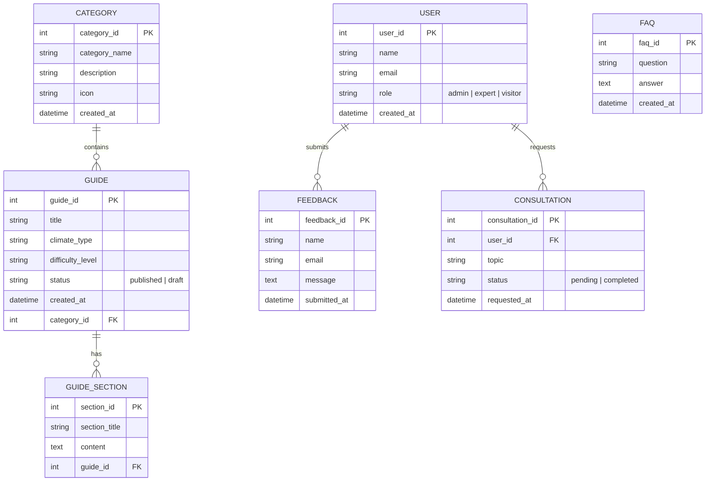

# ER Diagram

```mermaid
erDiagram

    USER {
        int user_id PK
        string name
        string email
        string role "admin | expert | visitor"
        datetime created_at
    }

    CATEGORY {
        int category_id PK
        string category_name
        string description
        string icon
        datetime created_at
    }

    GUIDE {
        int guide_id PK
        string title
        string climate_type
        string difficulty_level
        string status "published | draft"
        datetime created_at
        int category_id FK
    }

    GUIDE_SECTION {
        int section_id PK
        string section_title
        text content
        int guide_id FK
    }

    FAQ {
        int faq_id PK
        string question
        text answer
        datetime created_at
    }

    FEEDBACK {
        int feedback_id PK
        string name
        string email
        text message
        datetime submitted_at
    }

    CONSULTATION {
        int consultation_id PK
        int user_id FK
        string topic
        string status "pending | completed"
        datetime requested_at
    }

    %% Relationships
    CATEGORY ||--o{ GUIDE : contains
    GUIDE ||--o{ GUIDE_SECTION : has
    USER ||--o{ CONSULTATION : requests
    USER ||--o{ FEEDBACK : submits

```
